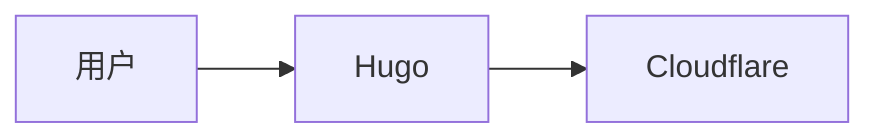

+++
title = "Hello World"
weight = 1
description = "这是第一篇博客，主要测试一些基础功能"

[params]
math = true
+++

#### 这是第一篇博客，主要用于验证markdown

```mermaid

graph LR

A[用户]

B[Hugo]

C[Cloudflare]

A --> B --> C

```

##### 数学公式验证
$$
E=mc^2
$$

$$
\int_0^\infty e^{-x^2} dx
$$